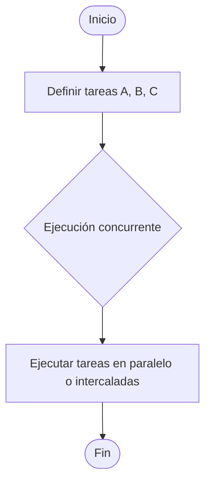
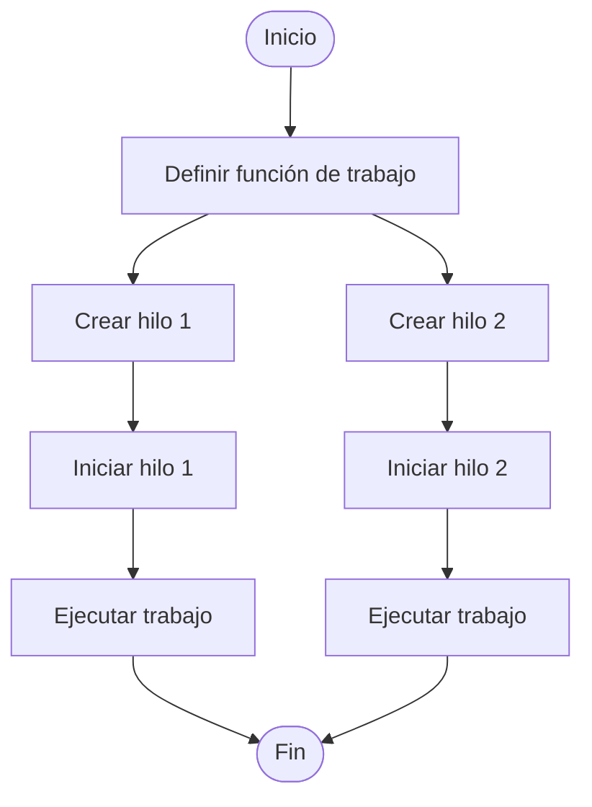
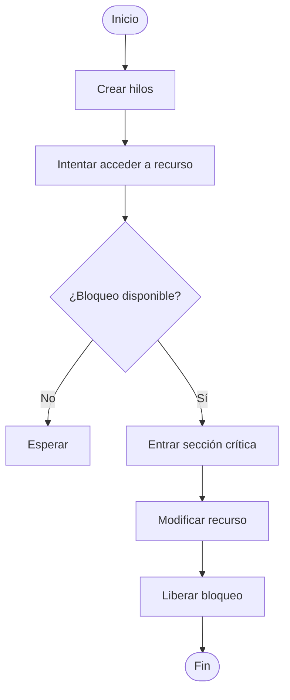

# Programación concurrente (multihilos): concepto, creación, control y sincronización
**Actividad T3-01 – Investigación documental**

**Autor:** Vazq-Leon  
**Fecha:** 2026-05-13  

---

## Introducción
La programación concurrente es un paradigma esencial en la informática actual, ya que permite ejecutar múltiples tareas dentro de un mismo sistema de manera simultánea o intercalada. Su uso es especialmente relevante en aplicaciones que requieren alto rendimiento, tiempos de respuesta bajos o la ejecución de múltiples operaciones al mismo tiempo, como servidores web, sistemas operativos, aplicaciones de escritorio y procesamiento de datos. En esta investigación documental se presentan los elementos fundamentales de la programación concurrente (multihilos): su concepto, la creación de hilos, el control de su ejecución y los mecanismos de sincronización. Asimismo, se mencionan de forma natural algunos problemas prácticos que este paradigma ayuda a resolver.

---

## 1. Concepto de programación concurrente (multihilos)
### 1.1 Tareas independientes
La concurrencia permite dividir el trabajo en tareas independientes que pueden ejecutarse en paralelo o intercalarse. Esto evita que una sola operación extensa bloquee el resto del programa. Por ejemplo, una aplicación puede procesar datos mientras sigue atendiendo solicitudes de usuario, lo que mejora la respuesta y evita tiempos de espera largos.

### 1.2 Ejecución simultánea o intercalada
En sistemas multinúcleo, los hilos pueden ejecutarse al mismo tiempo; en sistemas con un solo núcleo, el sistema operativo alterna rápidamente entre hilos para simular simultaneidad. Esto resuelve el problema de tener una sola secuencia de ejecución que deje al usuario sin respuesta mientras se realiza una tarea intensiva.

### 1.3 Compartición de recursos
Los hilos comparten memoria y recursos del proceso. Esta característica facilita el intercambio de datos entre tareas, pero también requiere mecanismos de control para evitar inconsistencias.

#### Pseudocódigo (concepto general)
```text
INICIO
  DEFINIR tarea_A
  DEFINIR tarea_B
  DEFINIR tarea_C

  EJECUTAR tarea_A, tarea_B, tarea_C EN CONCURRENCIA
FIN
```

#### Diagrama de flujo (Mermaid)


---

## 2. Creación de hilos
### 2.1 Instanciar hilos
Crear hilos significa inicializar nuevas unidades de ejecución dentro del mismo proceso. Esto permite dividir una tarea grande en varias tareas pequeñas que pueden ejecutarse simultáneamente, resolviendo problemas de lentitud al repartir carga.

### 2.2 Asignar función o tarea
Cada hilo ejecuta una función específica. La asignación clara de tareas evita conflictos y mejora la organización del trabajo concurrente.

### 2.3 Iniciar ejecución
El hilo se inicia y entra en ejecución según la planificación del sistema operativo. Con ello se resuelve el bloqueo de la aplicación al ejecutar tareas pesadas en un solo flujo.

#### Pseudocódigo
```text
INICIO
  DEFINIR funcion_trabajo()
    HACER trabajo
  FIN_FUNCION

  hilo_1 = CREAR_HILO(funcion_trabajo)
  hilo_2 = CREAR_HILO(funcion_trabajo)

  INICIAR(hilo_1)
  INICIAR(hilo_2)
FIN
```

#### Diagrama de flujo (Mermaid)


---

## 3. Control de hilos
### 3.1 Inicio
El inicio de un hilo pone en marcha su ejecución. Un control correcto asegura que los hilos inicien cuando los recursos estén disponibles.

### 3.2 Espera (join)
El hilo principal puede esperar a que otro hilo termine. Esto resuelve la necesidad de combinar resultados de tareas concurrentes antes de continuar.

### 3.3 Pausa y reanudación
Suspender o reanudar hilos ayuda a evitar conflictos por recursos y administra la carga de trabajo.

### 3.4 Finalización e interrupción
La interrupción controlada permite detener un hilo si ocurre un error, evitando que deje recursos bloqueados o el sistema en estado inconsistente.

#### Pseudocódigo
```text
INICIO
  hilo = CREAR_HILO(tarea)

  INICIAR(hilo)

  SI necesito_resultado ENTONCES
     ESPERAR_TERMINO(hilo)
  FIN_SI

  SI error_detectado ENTONCES
     INTERRUMPIR(hilo)
  FIN_SI
FIN
```

#### Diagrama de flujo (Mermaid)
```mermaid
flowchart TD
    A([Inicio]) --> B[Crear hilo]
    B --> C[Iniciar hilo]
    C --> D{¿Necesito resultado?}
    D -- Sí --> E[Esperar término (join)]
    D -- No --> F[Continuar]
    E --> G{¿Error detectado?}
    F --> G
    G -- Sí --> H[Interrumpir hilo]
    G -- No --> I([Fin])
    H --> I
```

---

## 4. Sincronización de hilos
### 4.1 Sección crítica
Es una parte del código donde se accede a un recurso compartido. Sin control, puede generar datos corruptos o inconsistencias.

### 4.2 Bloqueo (lock)
El bloqueo asegura acceso exclusivo a la sección crítica, resolviendo condiciones de carrera.

### 4.3 Liberación del recurso
Una vez terminada la operación, el recurso se libera para que otros hilos puedan usarlo.

### 4.4 Evitar condiciones de carrera
Al coordinar el acceso al recurso compartido, se garantiza la consistencia de los datos y la estabilidad del sistema.

#### Pseudocódigo
```text
INICIO
  RECURSO_COMPARTIDO = 0

  FUNCION hilo_trabajo()
    BLOQUEAR(recurso)
      RECURSO_COMPARTIDO = RECURSO_COMPARTIDO + 1
    DESBLOQUEAR(recurso)
  FIN_FUNCION

  CREAR_HILO(hilo_trabajo)
  CREAR_HILO(hilo_trabajo)
FIN
```

#### Diagrama de flujo (Mermaid)


---

## Conclusiones
La programación concurrente permite aprovechar los recursos del sistema de manera eficiente al dividir el trabajo en múltiples hilos. Su aplicación resuelve problemas comunes de rendimiento, latencia y bloqueo en aplicaciones modernas. Sin embargo, requiere comprender claramente el ciclo de vida de los hilos, su control y los mecanismos de sincronización para evitar errores como condiciones de carrera o interbloqueos. Una implementación correcta ofrece mejoras claras en capacidad de respuesta y escalabilidad.

---

## Referencias (formato APA)
Solano Gálvez, J. A., et al. (s. f.). *Hilos. Recursos Educativos para Todos.* Facultad de Ingeniería, UNAM. https://www.recursoseducativosparatodos.unam.mx/hilos

Pragma. (2022, 23 de junio). *Programación concurrente: Parte 1.* https://www.pragma.com.co/academia/lecciones/programacion-concurrente-parte-1

Instituto Tecnológico Superior de Loreto. (s. f.). *Unidad IV: Programación concurrente (Multihilos).* https://www.studocu.com/es-mx/document/instituto-tecnologico-superior-de-loreto/ingenieria-en-sistemas-computacionales/tap-subtema-3-1-apuntes/70195276

Sosa, A. (2026). *Programación concurrente (Unidad IV).* SlideShare. https://es.slideshare.net/slideshow/programacion-concurrente-70286246/70286246

Instituto Politécnico Nacional. (s. f.). *2.2 Modelo de multihilo.* https://comunidad.escom.ipn.mx/israelsr/RDD_SO_U2/pages/2-2-modelo-multi-hilo.html
